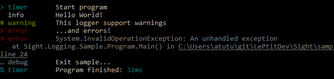
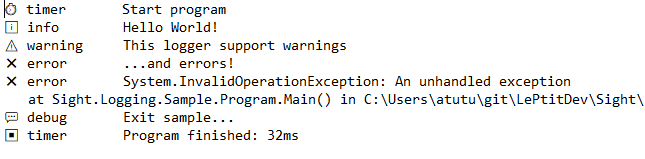

# Sight.Logging

[](https://www.nuget.org/packages/Sight.Logging/)

This library implement some loggers for console, file, memory, etc.

## Getting started

You can create a console logger and log some messages...

**Example:**
```csharp
var logger = new ConsoleLogger();
var stopwatch = logger.LogTimeStart("Start program");
logger.LogInformation("Hello World!");
logger.LogWarning("This logger support warnings");
logger.LogError("...and errors!");

try
{
    throw new InvalidOperationException("An unhandled exception");
}
catch (Exception ex)
{
    logger.LogError(ex);
}

logger.LogDebug("Exit sample...");
logger.LogTimeStop(stopwatch, "Program finished");
```

**Output:**



... or do the same thing with file.

**Example:**
```csharp
var logger = new FileLogger("logs.txt");
// ...
```

**Output:**



## Loggers

Availables loggers are:
- `ConsoleLogger` for console output
- `FileLogger` for file output
- `MemoryLogger` to keep logs in memory
- `MixedLogger` to log each message in multiple loggers
- `QueueLogger` to queue and process log messages
